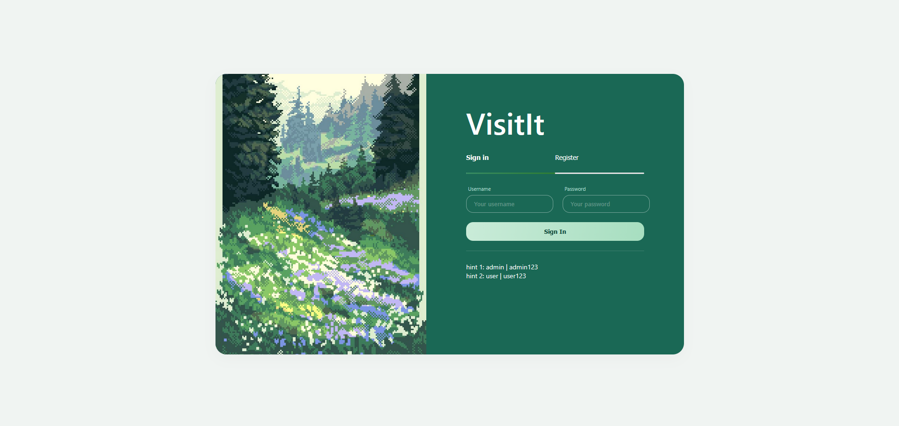
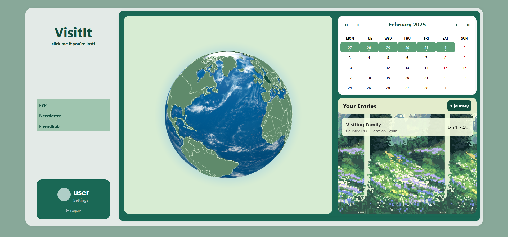
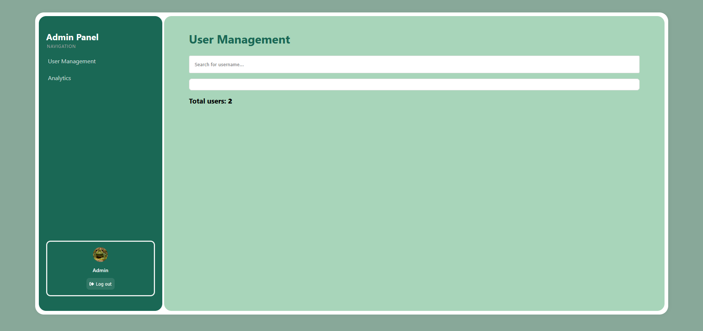
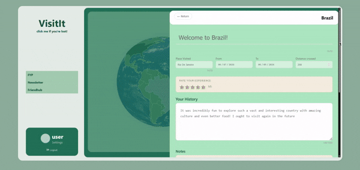
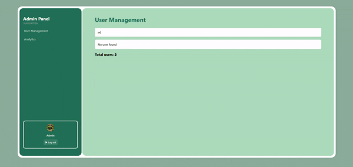

# VisitIt – Journey & Travel Blog! 🐸

A charming full-stack web application for logging past journeys with an interactive earth. A prototype with a smooth user experience in mind to assist in creating a digital diary. Nothing is more satisfying than seeing your progress visualized before your eyes. Enjoy!

*created by [Paulina](https://github.com/kaniapaulina) and [Natalia](https://github.com/nates012)*

---

## Screenshots

| | **Login Page** | |
| -- | --- | -- |
| |  | |

|  **User** | **Admin** |
| ---- | ---- |
|  |  |
| Adding a Journey as **User** | Searching up User as **Admin** |
|  |  |


---

<div style='padding-left: 40px'>

## Tech Stack

**Layer** and **Technologies**:
- Frontend - React 18, TypeScript, Vite, Axios, react-globe.gl
- Backend - ASP.NET Core 8 WebAPI, C#
- Database - SQL Server LocalDB, Entity Framework Core 8
- Auth - JWT Bearer, BCrypt password hashing

</div>

---

<div style='padding-left: 40px'>

## Features

**User**
- Login & Register with JWT authentication
- Interactive 3D globe – click countries to add journeys
- Rate trips (1-5 stars)
- Upload photos per journey
- Blog-style journey editor
- Journey list with expand/collapse
- Travel calendar highlighting visited days
- Delete journeys with confirmation

**Admin**
- Login with JWT authentication and specific authorization
- Admin dashboard (separate view)
- View all users and their journey - ban users or delete journeys when detected misdemeanor
- View statistics of all visited countries

</div>

---

<div style='padding-left: 40px'>

## Architecture

<table>
<tr>
  <th width="50%">
    Frontend
  </th>
  <th width="50%">
    Backend
  </th>
</tr>
<tr>
  <td valign="top" align='center'>
  <strong>React + TypeScript</strong><br>
    Port: 5173 (Vite)

```text

┌───────────────────────────────────────────────────────┐
│ src/                                                  │
│ ├── components/                                       │
│ │ ├── Map/ (Globe 3D, JourneyEditor)                  │
│ │ ├── Blog/ (JourneyList, JourneyView, Aside)         │
│ │ ├── Calendar/ (Travel calendar)                     │
│ │ ├── ImageUpload/ (Photo upload component)           │
│ │ ├── Sidebar/ (Navigation)                           │
│ │ └──AdminDash/ (UserManagment, Analytics)            |
│ ├── context/ (AuthContext)                            │
│ ├── hooks/ (useAuth, useJourneys)                     │
│ ├── pages/ (LoginPage, UserHome, AdminPage)           │
│ ├── services/ (Axios API client)                      │
│ └── types/ (TypeScript interfaces)                    │
│                                                       │
│ API calls: Axios → https://localhost:7201/api         │
└───────────────────────────────────────────────────────┘

```

</td>
<td valign="top" align='center'>
<strong>ASP.NET Core WebAPI</strong><br>
Port: 7201 (HTTPS) | 5294 (HTTP) 

```text

┌───────────────────────────────────────────────────────┐
│ |                                                     │
│ Controllers/                                          │
│ ├── AuthController (Login, Register)                  │
│ ├── JourneysController (CRUD, Upload images)          │
| └── UserController (Admin only - Ban users)           |
│ |                                                     │
│ Models/ (User, Journey)                               │
│ DTOs/ (UserDto, JourneyDtos)                          │
│ Services/ (AuthService – JWT generation)              │
│ Data/ (AppDbContext – EF Core)                        │
| Exceptions/ (Banned User handle)                      |
│ |                                                     │
│ Auth: JWT Bearer tokens (roles: Admin, User)          │
│ DB: SQL Server LocalDB (auto-migrated on startup)     │
│ Files: Stored in wwwroot/uploads/                     │
└───────────────────────────────────────────────────────┘

```

</td>

</tr>
</table>

</div>

---

<div style='padding-left: 40px'>

## Getting Started

### Prerequisites

- **.NET 8 SDK** – [download](https://dotnet.microsoft.com/download)
- **Node.js 18+** – [download](https://nodejs.org/)
- **SQL Server LocalDB** ([download](https://learn.microsoft.com/en-us/sql/database-engine/configure-windows/sql-server-express-localdb))


### 1. Clone the repository

<div style="background: #f5f5f5; border-radius: 8px; padding: 14px 14px 1px 14px; margin-bottom: 10px;">

```bash
git clone https://github.com/kaniapaulina/visitit.git
cd visitit
```

</div>

### 2. Backend setup

<div style="background: #f5f5f5; border-radius: 8px; padding: 14px 14px 1px 14px; margin-bottom: 10px;">

```bash
cd VisitIt.Backend/VisitIt.Backend/VisitIt.Backend
dotnet restore
dotnet run --launch-profile https
```

</div>

The API will be available at https://localhost:7201/swagger

### 3. Frontend setup

<div style="background: #f5f5f5; border-radius: 8px; padding: 14px 14px 1px 14px; margin-bottom: 10px;">

```bash
cd ../../..
cd VisitIt.Frontend
npm install
npm run dev
```

</div>

The app will be available at: http://localhost:5173

